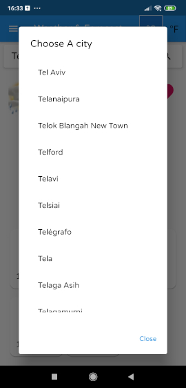
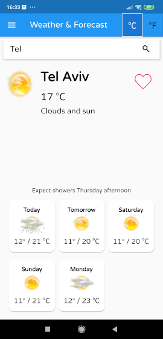
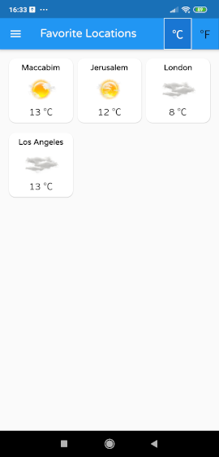
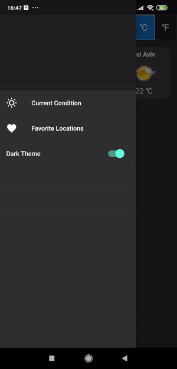
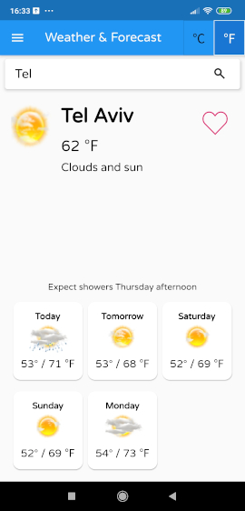

# WeatherApp

Simple weather app written with [Flutter](https://flutter.dev)

#### Demo App
You can download the (Android) demo app [here](output/demo_app.apk)


## Functionality
The app using the [Accuweather API](https://developer.accuweather.com>) that enable the user to perform the following actions: 
* Search a city through the [search auto-complete API](https://developer.accuweather.com/accuweather-locations-api/apis/get/locations/v1/cities/autocomplete).
* Showing current weather data of the location he selected through the [current weather conditions API](https://developer.accuweather.com/accuweather-current-conditions-api/apis/get/currentconditions/v1/%7BlocationKey%7D). 
* Showing forecast for the following five days through the [five days forecast API](https://developer.accuweather.com/accuweather-forecast-api/apis/get/forecasts/v1/daily/5day/%7BlocationKey%7D).
  
  

## Features

#### Basic
* Search for a city in the world and get its forecast & current conditions.
* Adding a city to favorites.
* **Get forecast by user's geolocation**.
* **Dark\Light mode**.
* **Using Fahrenheit\Celsius units**.

*Note: Bonuses are* **bold**

#### Additional

* Refreshing results by pulling down.
* Keeping history of latest searches

## Tech details

* **State management**: [BLoC](https://pub.dev/packages/flutter_bloc)  
* **Architecture**: Clean Architecture ,embracing a TDD methodology with [dartz](https://pub.dev/packages/dartz) for Functional Programming 
* **Dependency Injection**: [get_it](https://pub.dev/packages/get_it) (To be accurate, it's a service locator)
* **HTTP**: Using [dio](https://pub.dev/packages/dio) library for handling HTTP requests + [retrofit](https://pub.dev/packages/retrofit) as REST Client generator  
* **Caching**: Using [hive](https://pub.dev/packages/hive) as a local db (better than [Shared Preferences](https://pub.dev/packages/shared_preferences)) 

## Screenshots

* Choose a city



* Forecast Screen (used as the "Home" screen):



* Favorites Locations:



* Toggling Dark/Light theme:



* Showing Fahrenheit unit:



### Use It

Accuweather API requires you to create an app and retrieve an API key in order to perform requests.
 #### Env Variables

In order to use the app with your API key, create a file in `config/app_config.json` in the project's root folder, contains the following:
```json
{
  "ACCUWEATHER_API_KEY":"your_accuweather_app_api_key"
}
```